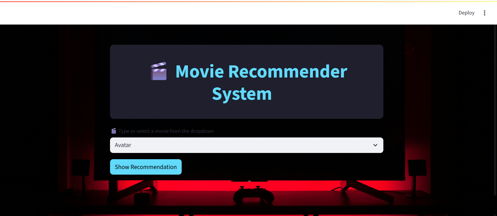
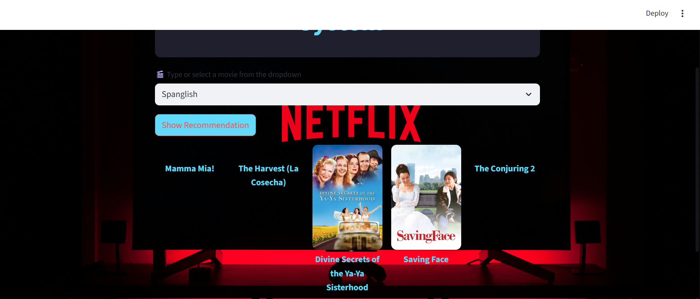

# 🎬 Movie Recommender System

A **content-based movie recommendation system** built with **Streamlit** and **TMDB API**.  
Users can select a movie from a dropdown list, and the app recommends **5 similar movies** with posters, trailers, and TMDB links.

---

## 🚀 Features
- 🎯 **Content-Based Filtering** — Finds movies similar to the one selected
- 🖼️ **Movie Posters** — Fetched dynamically using TMDB API
- ▶️ **Trailers** — Watch the trailer directly on YouTube
- 🔗 **TMDB Links** — Redirect to detailed movie info
- 🎨 **Custom Background & Styling** — Clean and responsive UI

---

## 📦 Requirements

Make sure you have **Python 3.8+** installed. Install dependencies with:

```bash
pip install -r requirements.txt
git clone https://github.com/skr42/Movie-Recommendation-System.git
cd movie-recommender

pip install -r requirements.txt


streamlit run app.py

```
## Project Structure
```
movie-recommender/
│── .gitignore
│── app.py
│── app1.py
│── app2.py
│── app4.py
│── img.jpg
│── movie_list.pkl
│── movie_recommendation_model.pkl
│── netflix.jpg
│── OUTPUT
│── README.md
│── requirements.txt

```
## 📸 Demo Screenshots

### 🖼️ App Preview


